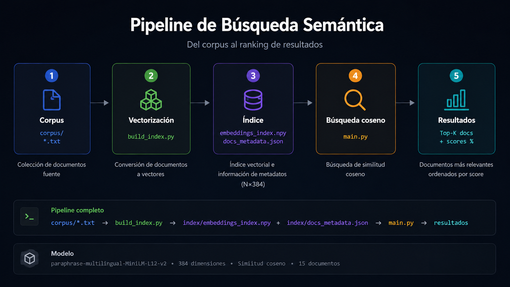

# Busqueda Semantica con Embeddings Vectoriales

Encuentra documentos por lo que quieren decir, no por las palabras que usan. Un motor de busqueda que entiende el significado de tu consulta y encuentra documentos relevantes aunque no compartan una sola palabra.

Construido sobre un corpus de 15 documentos educativos en espanol sobre inteligencia artificial y machine learning.

## Como Funciona

El proyecto implementa un pipeline de dos etapas:



### Etapa 1: Indexacion (`build_index.py`)

1. **Carga** todos los archivos `.txt` del directorio `corpus/`
2. **Genera embeddings** para cada documento usando un modelo multilingual de sentence-transformers
3. **Guarda** los vectores y metadatos en el directorio `index/`

### Etapa 2: Busqueda (`main.py`)

1. **Carga** el indice pre-construido desde `index/` y el modelo de embeddings
2. **Codifica** la consulta del usuario en el mismo espacio vectorial
3. **Calcula similitud coseno** entre el vector de la consulta y todos los vectores del corpus
4. **Retorna** los documentos ordenados por relevancia semantica

Incluye un baseline TF-IDF para comparar busqueda semantica vs. busqueda lexical tradicional.

## Requisitos

- Python 3.10 o superior
- pip

## Instalacion

```bash
# Clonar el repositorio
git clone <url-del-repo>
cd busqueda-semantica

# Crear y activar entorno virtual
python -m venv .venv
.venv\Scripts\activate   # Windows
# source .venv/bin/activate  # Linux/macOS

# Instalar dependencias
pip install -r requirements.txt
```

## Uso

Toda la busqueda se concentra en un solo script.

```bash
# Modo interactivo (por defecto)
python main.py

# Busqueda directa desde la terminal
python main.py "como funciona una red neuronal?"
```

### Comandos interactivos

Escribi tu consulta y el sistema responde. Usa comandos con `/` para acciones especiales:

| Comando | Accion |
|---------|--------|
| `<consulta>` | Busqueda semantica |
| `/c <consulta>` | Comparar semantico vs TF-IDF |
| `/top <N>` | Cambiar cantidad de resultados (default: 5) |
| `/build` | Reconstruir el indice desde `corpus/` |
| `/help` | Mostrar todos los comandos |
| `/q` | Salir |

### Reconstruir el indice

```bash
# Desde el modo interactivo
/build

# O directamente desde la terminal
python build_index.py

# Con opciones personalizadas
python build_index.py --model all-MiniLM-L6-v2 --corpus corpus/ --output index/
```

| Opcion | Default | Descripcion |
|--------|---------|-------------|
| `--model` | `paraphrase-multilingual-MiniLM-L12-v2` | Modelo de sentence-transformers |
| `--corpus` | `corpus` | Directorio con archivos `.txt` |
| `--output` | `index` | Directorio de salida para el indice |

## Estructura del Proyecto

```
busqueda-semantica/
├── main.py                  # Buscador interactivo (unico entry point)
├── build_index.py           # Indexacion del corpus
├── requirements.txt         # Dependencias
├── README.md                # Este archivo
├── corpus/                  # Documentos de entrada (15 .txt)
│   ├── 01_sistemas_expertos_intro.txt
│   ├── 02_redes_neuronales.txt
│   ├── ...
│   └── 15_aprendizaje_refuerzo.txt
└── index/                   # Archivos generados
    ├── embeddings_index.npy     # Matriz de vectores (N_docs x 384)
    └── docs_metadata.json       # Metadatos (titulo, archivo, texto)
```

## Glosario

### Conceptos fundamentales

| Termino | Explicacion |
|---------|-------------|
| **Embedding** (o vector semantico) | Representacion numerica de un texto en forma de lista de decimales. Dos textos con significado similar producen vectores cercanos entre si. |
| **Similitud coseno** | Medida que calcula que tan parecidos son dos vectores. Va de 0 (nada parecidos) a 1 (identicos). Es la metrica que usa el buscador para rankear resultados. |
| **Corpus** | Conjunto de documentos que se indexan para poder buscar sobre ellos. Aca son los 15 archivos `.txt` en la carpeta `corpus/`. |
| **Indice** | Archivos generados (`embeddings_index.npy` y `docs_metadata.json`) que guardan los vectores pre-calculados de cada documento. Sin indice no hay busqueda rapida. |
| **Indexacion** | Proceso de convertir cada documento del corpus en su embedding y guardarlo en el indice. Se ejecuta una vez y luego se reutiliza. |
| **Modelo de embeddings** | Programa de IA pre-entrenado que convierte texto en vectores. Este proyecto usa `paraphrase-multilingual-MiniLM-L12-v2`, que entiende espanol y otros 50 idiomas. |
| **Top-K** | Cantidad de resultados que devuelve el buscador. K=5 significa "mostrame los 5 documentos mas relevantes". |

### Metodos de busqueda

| Termino | Explicacion |
|---------|-------------|
| **Busqueda semantica** | Busca por el significado de la consulta, no por coincidencia literal de palabras. Si preguntas "autos" encuentra documentos sobre "vehiculos". |
| **Busqueda lexical** | Busca coincidencia exacta de palabras entre la consulta y los documentos. Si preguntas "autos" NO encuentra documentos que solo dicen "vehiculos". |
| **TF-IDF** | Algoritmo clasico de busqueda lexical. Mide que tan importante es cada palabra en un documento respecto al resto del corpus. Se usa aca como baseline de comparacion. |
| **Baseline** | Punto de referencia para medir que tan bueno es un metodo. Comparar los embeddings contra TF-IDF muestra la diferencia entre busqueda semantica y lexical. |

### Tecnologias

| Termino | Explicacion |
|---------|-------------|
| **Sentence Transformers** | Libreria que facilita el uso de modelos de embeddings. Permite convertir oraciones y parrafos enteros en vectores con pocas lineas de codigo. |
| **HuggingFace** | Plataforma que aloja modelos de IA de uso libre. El modelo de este proyecto se descarga automaticamente desde HuggingFace la primera vez que se ejecuta. |
| **Rich** | Libreria de Python que da formato profesional a la terminal: colores, tablas, paneles. Es lo que hace que la interfaz del buscador se vea como se ve. |

### Inteligencia Artificial (temas del corpus)

| Termino | Explicacion |
|---------|-------------|
| **Red neuronal artificial** | Modelo inspirado en el cerebro biologico. Capas de "neuronas" interconectadas que aprenden patrones a partir de datos. |
| **Transformer** | Arquitectura de redes neuronales que revoluciono el procesamiento de lenguaje. Es la base de modelos como BERT, GPT y Claude. |
| **Aprendizaje supervisado** | Tecnica donde el modelo aprende con ejemplos etiquetados: "esta imagen es un gato", "esta es un perro". |
| **Aprendizaje por refuerzo** | Tecnica donde un agente aprende por prueba y error, recibiendo recompensas o castigos segun sus acciones. |
| **Logica difusa** | Extension de la logica clasica que permite manejar incertidumbre. Algo puede ser "parcialmente verdadero" en vez de solo verdadero o falso. |
| **Sistema experto** | Programa que emula el razonamiento de un especialista humano usando una base de conocimiento y reglas logicas. |
| **Algoritmo genetico** | Tecnica de optimizacion inspirada en la evolucion biologica: seleccion natural, cruce y mutacion aplicados a soluciones candidatas. |
| **Arbol de decision** | Modelo que toma decisiones en cadena haciendose preguntas binarias sobre los datos. Facil de interpretar visualmente. |
| **SVM (Maquina de soporte vectorial)** | Algoritmo que encuentra la mejor frontera para separar datos de distintas categorias. |
| **Deep Learning** | Aprendizaje profundo: redes neuronales con muchas capas que aprenden caracteristicas jerarquicas de los datos sin intervencion humana. |
| **NLP (Procesamiento del Lenguaje Natural)** | Campo de la IA que estudia como las computadoras entienden y generan lenguaje humano. |
| **Representacion del conocimiento** | Como almacenar informacion sobre el mundo de forma que un sistema computacional pueda razonar con ella. |
| **Motor de inferencia** | Componente de un sistema experto que aplica reglas logicas sobre la base de conocimiento para derivar conclusiones. |

## Dependencias

| Dependencia | Version | Uso |
|-------------|---------|-----|
| `sentence-transformers` | >= 2.7.0 | Modelo de embeddings |
| `numpy` | >= 1.26.0 | Almacenamiento de vectores |
| `scikit-learn` | >= 1.4.0 | Similitud coseno y TF-IDF |
| `rich` | >= 13.0.0 | Interfaz de terminal |

## Modelo

Por defecto se usa `paraphrase-multilingual-MiniLM-L12-v2`, un modelo de Sentence-BERT que:

- Soporta **50+ idiomas** (incluyendo espanol)
- Produce embeddings de **384 dimensiones**
- Balancea velocidad y precision
- La primera ejecucion descarga ~120 MB a la cache de HuggingFace
- Cambiar de modelo requiere **reconstruir el indice**

## Corpus

Los 15 documentos cubren conceptos fundamentales de IA:

Sistemas Expertos, Redes Neuronales, Aprendizaje Supervisado, NLP, Algoritmos Geneticos, Embeddings Vectoriales, Arboles de Decision, Motores de Inferencia, Deep Learning, Busqueda Semantica, Logica Difusa, SVM, Representacion del Conocimiento, Transformers y Aprendizaje por Refuerzo.

## Notas

- Ambos scripts (`main.py` y `build_index.py`) usan el **mismo modelo**. Si cambias de modelo, reconstrui el indice con `/build` o `python build_index.py`.
- Las consultas deben estar en **espanol** para mejor resultado con este corpus.
- El indice pre-construido en `index/` ya viene incluido en el repositorio.
